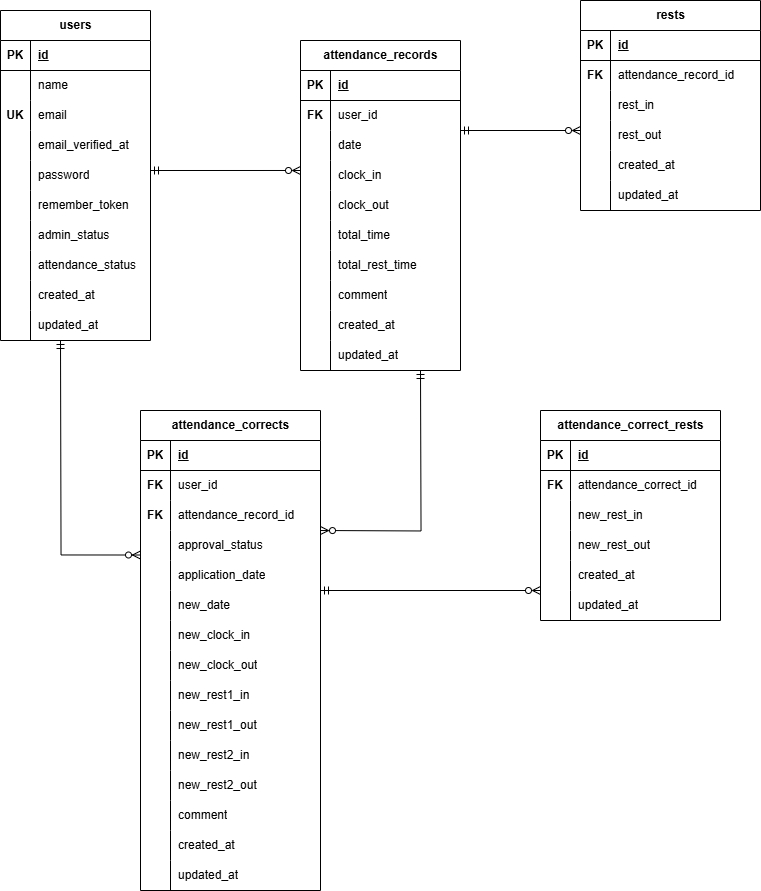

# coachtech フリマ

## 環境構築
**Dockerビルド**
1. `git clone git@github.com:renayashiki/mogi-furima.git`
2. `cd /coachtech/laravel/mogi-furima`
3. DockerDesktopアプリを立ち上げる
4. `docker-compose up -d --build`

<br>

**Laravel環境構築**
1. `docker-compose exec php bash`
2. `# composer install`<br>
`chmod -R 777 storage bootstrap/cache`
>※Docker環境でのログ出力や画像保存時のエラー（Permission Denied）を防ぐため、必ず実行してください。
3. 「.env.example」ファイルを 「.env」ファイルに命名を変更。または、新しく.envファイルを作成

    `# cp .env.example .env`

4. 環境変数の設定
>DBの設定ー.envに以下の環境変数を修正
``` text
DB_CONNECTION=mysql
DB_HOST=mysql
DB_PORT=3306
DB_DATABASE=laravel_db
DB_USERNAME=laravel_user
DB_PASSWORD=laravel_pass
```
<br>

>メール認証機能の設定・確認方法 (MailHog)ー.env.example` にあらかじめ MailHog 用の設定を記載しているため、環境構築後すぐにメール認証のテストが可能ですが、.envが以下の内容と相違がある場合は、書き換えが必要なため必ず内容を確認してください。

- src/.envに以下のように変更
``` bash
MAIL_MAILER=smtp
MAIL_HOST=mailhog
MAIL_PORT=1025
MAIL_USERNAME=null
MAIL_PASSWORD=null
MAIL_ENCRYPTION=null
MAIL_FROM_ADDRESS="no-reply@example.com"
MAIL_FROM_NAME="${APP_NAME}"
```
<br>


5. アプリケーションキーの作成
``` bash
php artisan key:generate
```

<br>

6. データベース構築と初期データ投入
``` bash
php artisan migrate:fresh --seed
```
<br>

7. テストの実行方法（PHPUnit）
<br>
今回の模擬案件では、仕様に基づいた自動テスト（PHPUnit）を実装しています。
評価の際は、以下の手順でテスト用環境を構築することで、テストを実行いただけます。

<br>

###### 1.テスト用データベースの作成
コマンドラインから、テスト専用のデータベースを作成してください。

``` bash
docker compose exec mysql bash
```
``` bash
# mysql -u root -p

- パスワード: root
```
> DBを作成
```sql
CREATE DATABASE IF NOT EXISTS mogi_furima_test;
```
<br>

> 権限付与
```sql
GRANT ALL PRIVILEGES ON mogi_furima_test.* TO 'laravel_user'@'%';
```
<br>

```sql
FLUSH PRIVILEGES;
EXIT;
```
<br>


###### 2.テスト用環境変数の設定
phpコンテナにて
``` bash
cp .env .env.testing
```
- .env.testing の修正箇所：
> DB_DATABASE=  ※　ここ今回のに変更mogi_furima_test

<br>

###### 3.テスト用データベースのマイグレーション
``` bash
php artisan migrate --env=testing
```

###### 4.テストの実行
- 全てのテストを一括実行
``` bash
php artisan test
```
- 特定の機能のみを実行（例：会員登録機能）
``` bash
php artisan test tests/Feature/RegisterTest.php
```


###### 5.テストケース ファイル一覧
- 仕様書内のテストケース一覧のID毎にテストケースファイルを作成しております。参考としてお使いください。


<br>

## 動作確認用情報
### テスト用アカウント
- 以下のダミーデータを使用して、管理者・一般ユーザーそれぞれの機能を動作確認いただけます。 パスワードは全アカウント共通で password123 です。


 **管理者アカウント**

``` bash
 'name' => '管理者',
 'email' => 'admin@coachtech.com',
 'password' => 'password123'
```
> 管理者システムへログインし、操作を確認できます。

**一般ユーザー：西 伶奈（一般画面確認用）**
``` bash
 'email' => 'reina.n@coachtech.com',
 'password' => 'password123'
```
> 2023年6月の勤怠一覧において、figma見本同様に表示されているか確認できます。 また、直近の日付でも機能が確認しやすいように、見本UI通りを保持しつつ、直近の日付でもダミーデータを挿入しています。

**特記事項**
- 管理者ページの申請一覧見本UIでは「山田 花子」というユーザーが存在しますが、スタッフ一覧ページ見本UIでは「山田 花子」は存在していない見本通りの形に再現しています。

- 見本UI画像では「西 伶奈」が存在しており、スタッフ一覧画面の見本UIにのみ「西 "玲"奈」という表示がありますが、タイプミスが起こっていることが想定されましたが、見本や仕様を忠実に再現することを優先し、スタッフ別勤怠一覧画面では2023/06/01の月次勤怠の「西 伶奈」であろうユーザーは見本通りの「西 玲奈」の表示にあえて合わせて表示しています。

**スタッフ一覧に存在する他ユーザー**

| 名前 | メールアドレス | ログイン時の状態 |
| :--- | :--- | :--- | :--- | 山田 太郎 | `taro.y@coachtech.com` | ログイン直後から「勤務外」 | 増田 一世 | `issei.m@coachtech.com` | ログイン直後から「出勤中」 |秋田 朋美 | `tomomi.a@coachtech.com` | ログイン直後から「休憩中」 | 中西 教夫 | `norio.n@coachtech.com` | ログイン直後から「退勤済」 |
<br>

## 使用技術(実行環境)
- PHP: 8.1.34
- Laravel: 8.75 以上
- MySQL: 8.0.26
- nginx: 1.21.1


## URL
- 開発環境：http://localhost/
- phpMyAdmin: http://localhost:8080/
- メール認証サイト(MailHog):http://localhost:8025/

<br>


## テーブル設計


> profilesテーブルはユーザーの表示用・編集用情報を管理するためにusersテーブルと分離しています。認証情報とプロフィール情報の責務を分け、将来的な拡張や管理性を考慮した設計としています


> 本アプリでは「1商品につき画像1枚」という仕様のため、商品画像はproductsテーブルにimageカラムとして保持しています。この点に関しては、将来的な画像対応よりも仕様に忠実な形でシンプルな構成を選択しました。将来的に複数画像で対応する場合は別テーブルに切り出す想定。


模擬①.png)
> categories と products は多対多関係となり、中間テーブルproduct_categories を使用しています。複合ユニーク：(category_id, product_id)


> comments はユーザーと商品の中間テーブルではなく、独立したエンティティとして管理しています


> favoritesは中間テーブルではなく、独立したエンティティとして管理しています。※ 複合ユニーク：(user_id, product_id)


## ER図


